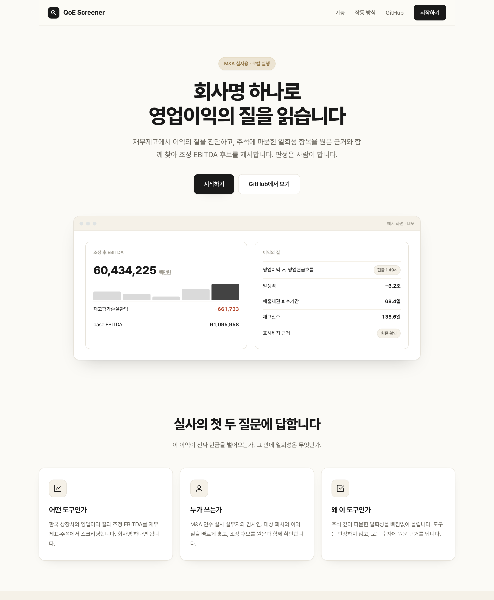
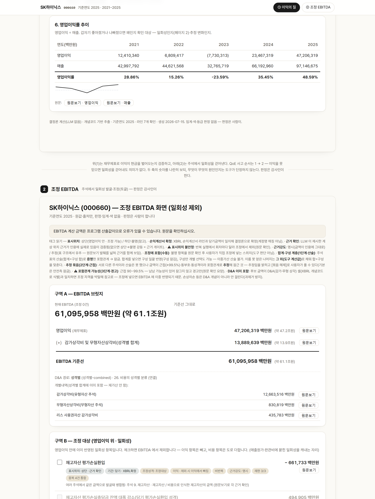
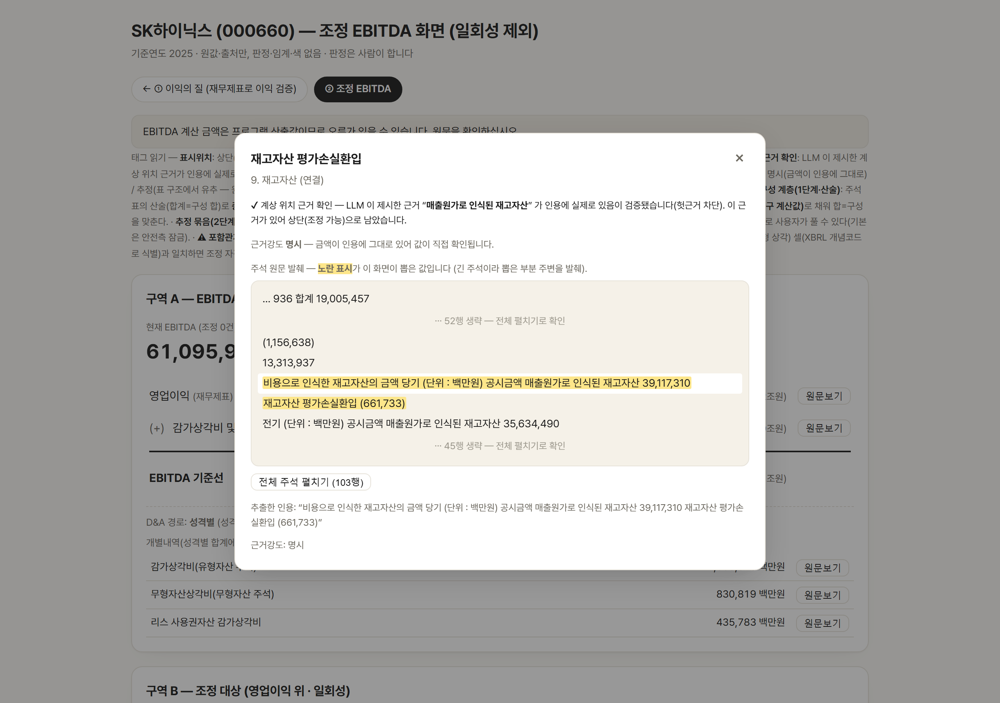

# QoE 스크리너 (QoE Screener)

🇰🇷 한국어

**회사 이름 하나만 넣으면, 재무제표에서 영업이익의 질을 진단하고,
주석에 파묻힌 일회성 항목을 원문 근거와 함께 찾아 조정 EBITDA 후보를
정리해 보여주는 도구입니다. — 판정은 감사인·실무자가 합니다.**

## ▶️ 데모 영상

(https://youtu.be/O2AyQVsNNZ0)

▶️ **[데모 영상 링크]**

## 이런 도구입니다

M&A 실사나 감사에서 가장 먼저 묻는 것은 "이 회사가 보고한 영업이익을
믿어도 되는가"입니다. 그런데 재무제표만으로는 답하기 어렵습니다.

- **이익이 진짜 현금을 벌어오는지 안 보입니다** — 장부상 이익이 커도 현금이
  안 따라오면 이익의 질이 의심스럽습니다.
- **중요한 일회성이 묻힙니다** — 재고평가손실·구조조정비·충당부채 환입 같은
  일회성 손익이 매출원가·판관비 안에 한 줄로 파묻혀, 손익계산서만 봐선
  보이지 않습니다.

기존 방식은 감사인이 방대한 주석을 직접 뒤져야 하고, 찾더라도 그게 영업이익
안에 있는지·이미 감가상각에 포함됐는지·중복은 아닌지를 일일이 따져야 합니다.

이 도구는 그 일을 **네 단계**로 대신합니다.

1. 회사 이름으로 재무제표와 주석을 **수집하고**
2. 재무제표 지표로 **영업이익의 질을 진단하고** (이익이 현금을 벌어오는가)
3. 주석에서 영업이익 안에 파묻힌 **일회성 항목을 발굴해** 조정 EBITDA
   후보로 만들고
4. 각 후보를 **재무제표·주석 원문에 연결해 근거와 함께** 보여 줍니다.

회사명 하나 넣고 기다리면, 이익의 질과 조정 EBITDA 후보를 원문 근거와 함께
한자리에 정리해 줍니다.

## 누구에게·왜 필요한가

**이런 분들을 위해 만들었습니다 — M&A 인수 실사 실무자와 회계법인 감사팀.**
인수 대상의 영업이익 질을 검토할 때, 감사계획을 세울 때, 대상 회사의 정상화
이익을 가늠할 때 쓰는 도구입니다.

**실무자가 실제로 겪는 어려움**

- 일회성 항목이 **주석 깊숙이 흩어져 있어**, 직접 찾으려면 방대한 주석을
  전부 읽어야 합니다.
- 찾더라도 그게 **영업이익 안에 있는지, 이미 감가상각에 포함됐는지, 다른
  항목과 겹치는지**를 일일이 따져야 EBITDA를 틀리지 않게 조정할 수 있습니다.

**이 도구가 해결하는 방식**
주석을 넓게 읽어 일회성 후보를 빠짐없이 올린 뒤, 각 후보가 영업이익 안에
있는지를 원문 근거로 확인하고, 이미 감가상각에 포함됐거나 중복된 것을
걸러냅니다. 판단마다 원문 근거가 붙어, 실무자는 정리된 결과를 보고 스스로
조정 여부를 판정합니다.

**이렇게 활용합니다**

- **인수 실사** — 대상 회사의 정상화 EBITDA를 가늠하는 1차 스크리닝
- **감사계획** — 이익의 질과 일회성 손익을 사전 파악
- **정상화 검토** — 영업이익에 섞인 일회성을 걷어낸 기준선 확인

## 이렇게 나옵니다

회사명 하나를 넣으면 아래처럼 나옵니다.



*랜딩 화면 — 제품 소개와 시작 버튼.*



*결과 화면 — ① 이익의 질(재무제표 지표)과 ② 조정 EBITDA(일회성 조정 후보)를
한 페이지에서. 조정 여부는 직접 토글해 판단합니다.*



*원문 근거 — 각 후보의 숫자가 재무제표·주석 어디서 왔는지 표를 재구성해
하이라이트로 보여 줍니다.*

## 실행 방법

필요한 것: **Python 3**, 그리고 **API 키 2개**(아래 발급처 참고).

```
(최초 1회)  pip install -r requirements.txt

start_qoe.bat  더블클릭        ← Windows
./start_qoe.sh                 ← macOS / Linux

브라우저가 http://127.0.0.1:5000 을 자동으로 엽니다
화면에서 API 키 2개 입력 → 회사명 입력 → 결과 확인
```

> **이 도구는 내 PC에서 돌아갑니다.** 실행 파일을 더블클릭하면 창이 하나 열리고
> 잠시 뒤 브라우저가 자동으로 열립니다. **쓰는 동안 이 실행 창을 닫지 마세요 —
> 이 창이 서버를 유지합니다.** 다 쓴 뒤 창을 닫으면 서버가 꺼집니다.

**API 키 2개가 필요합니다.** Open DART는 **무료**로 발급받고, Anthropic(Claude)
API는 쓴 만큼 내는 **유료**라 소액의 크레딧이 필요합니다.

| 키 | 발급처 |
|---|---|
| `OPENDART_API_KEY` | https://opendart.fss.or.kr (오픈다트 인증키) |
| `ANTHROPIC_API_KEY` | https://console.anthropic.com |

> 키는 **화면에서 입력**하며, 이 PC의 메모리에만 잠깐 머물다 서버를 끄면
> 사라집니다. 파일이나 기록에 저장하지 않고, 내 PC 안에서만 돌아 밖으로 나가지
> 않습니다. (키 이름만 담긴 `.env.example`을 참고하세요.)

직접 돌리지 않아도, 미리 실행해 둔 예시 결과를 저장소의 `out/results/` 폴더에서
바로 볼 수 있습니다. (대기업 6사 + 중소형 2사)

## 이 도구가 신경 쓴 것

만들면서 특히 공들인 네 가지입니다.

**1. 정해진 단어 목록이 아니라, 숫자가 맞는지로 판단합니다.**
'재고평가손실' 같은 단어만 찾으면, 목록에 없는 항목은 놓치고 회사마다 다르게
쓰는 표현을 담지 못합니다. 이 도구는 주석 전체를 읽은 뒤, 각 항목이 영업이익
안에 있는지·이미 다른 곳에 반영됐는지·중복은 아닌지를 **주석 표에서 숫자가
실제로 맞아떨어지는지**로 따집니다.

**2. 확실하지 않으면 조정하지 않습니다.**
EBITDA는 인수 가격의 기준이 되는 숫자라 틀리면 안 됩니다. 그래서 이 도구는
어떤 항목이 영업이익 안에 있다는 근거를 원문에서 찾지 못하면, 조정하지 않고
그대로 둡니다. 실제 원문과 하나하나 대조해 확인한 결과, 도구가 '조정 가능'으로
올린 항목은 모두 근거가 맞았습니다. 같은 항목이 두 번 반영되는 일도 여러 겹으로
막습니다.

**3. 모든 숫자에 근거를 붙여, 감사인이 직접 확인합니다.**
숫자마다 '원문보기'가 붙습니다. 그 숫자가 재무제표·주석 어디서 나왔는지 원래
표를 다시 보여 줍니다. 근거가 없으면 조정하지 않으며, 최종 조정 여부는 언제나
감사인이 화면에서 직접 정합니다.

**4. 특정 회사가 아니라 어느 상장사든 동작합니다.**
특정 회사에만 맞춘 설정을 넣지 않았습니다. 회사 이름만 넣으면 어느 상장사든
같은 방식으로 처리합니다. (반도체·전자·화학·항공·플랫폼·유통 등 여러 업종과
중소형 회사에서 확인했습니다.)

## 알아두기 (한계)

- **금융업은 범위 밖입니다** — 은행·보험·증권은 손익 구조가 달라, 이 도구의
  방식이 맞지 않습니다.
- **1차 스크리닝입니다** — 도구가 후보를 빠짐없이 올리려 하지만, 빠진 것이
  없다는 보장은 없습니다. 완전한 체크리스트가 아니라, 감사인의 검토를 돕는
  출발점입니다.

---
_교육·리서치 목적의 로컬 실행 도구입니다._
